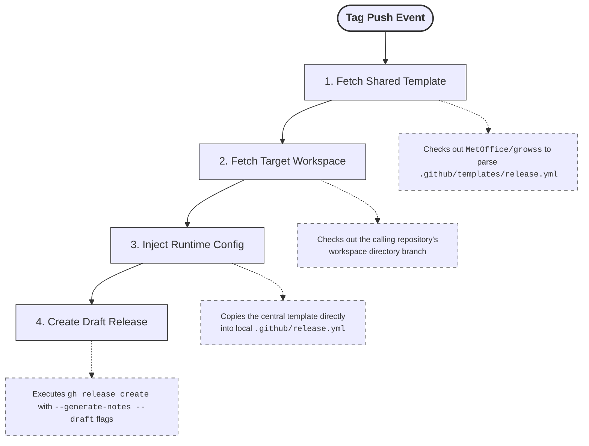

# Draft Release

A reusable GitHub Actions [workflow](../.github/workflows/draft-release.yaml)
that automates the creation of a draft GitHub release with an auto-generated
changelog, driven by a centralised shared release template.

## Features

- **Zero Boilerplate:** Fetches a centralised configuration template from
  [MetOffice/growss](https://github.com/MetOffice/growss) and injects it into
  the calling repository at runtime. Downstream repositories do not need to
  maintain a local `.github/release.yml` file.
- **Strict Label Prioritization:** Generates a structured changelog dynamically
  grouped by PR labels using the centralised
  [release template](../.github/templates/release.yml).
- **Safe Review Gate:** Creates the release in **draft** state, allowing
  maintainers to audit or adjust notes before going live.
- **Secure Architecture:** Native platform authentication passes `GITHUB_TOKEN`
  seamlessly to handle both public and private repository cross-boundary
  checkouts securely.
- Tags the draft release with the triggering Git ref name (e.g. `v1.2.3`).

## Changelog Categories for Simulation Systems

Pull Requests are evaluated sequentially from **top to bottom**. A PR lands
exclusively in the first category it satisfies. Single PRs will never be
duplicated across separate sections.

| Category | Labels | Example |
| -------- | ------ | ------- |
| 💥 Breaking Changes | `breaking-change` | Critical infrastructure changes, breaking adjustments, or API removals. |
| 🐛 Bug Fixes | `bugfix` | Code corrections or hotfixes resolving functional issues. |
| ✨ New Features | `feature` | Customer-facing features, enhancements, or structural additions. |
| 🔬 Scientific & Algorithmic Updates | `science`, `technical` | **science:** Domain-specific mathematical changes or model updates.<br>**technical:** Deep algorithmic optimizations or background logic shifts.|
| 📚 Documentation | `documentation` | Changes isolated to READMEs, inline code docstrings, scientific documentation, working practices, or other non-functional documentation updates. |
| ⚡ Performance Improvements | `performance`, `optimization` | **performance:** Direct speed execution metrics or runtime improvements.<br>**optimization:** Memory, storage, or other resource optimizations. |
| ♻️ Refactoring | `refactor` | Code layout cleanup or modularisation without behavior changes. |

### Excluded Labels

PRs carrying any of the following labels are **hidden** from the changelog output
entirely, regardless of any other labels they carry:

| Label | Purpose |
| ----- | ------- |
| `build` | Changes to build tools or external compiler toolchains |
| `chore` | General housekeeping, licence updates, or minor admin tasks |
| `ci` | Infrastructure automation changes or GitHub Actions workflow logic updates |
| `dependencies` | Automated third-party package upgrades (e.g. Dependabot) |
| `ignore-changelog` | Manual escape-hatch label used to explicitly suppress a specific PR from release logs |
| `test` | Unit tests additions, test framework assertions, or mock suite configurations |
| `wip` | Work-in-progress PRs not ready for release |

## Permissions

The calling execution job block must explicitly declare `contents: write`
to authorize the native GitHub CLI runner to write assets and publish release footprints:

```yaml
permissions:
  contents: write
```

## Usage

### Variant A: Production Tag Auto-Trigger (Recommended)

```yaml
name: Draft Release Deployment

on:
  push:
    tags:
      - "v*" # Triggers automatically for semantic production tags

jobs:
  release:
    uses: MetOffice/growss/.github/workflows/draft-release.yaml@main
    permissions:
      contents: write
```

### Variant B: Hybrid Trigger (Tag Push + Manual Run)

```yaml
name: Draft Release Deployment

on:
  push:
    tags:
      - "v*"
  workflow_dispatch:

jobs:
  release:
    uses: MetOffice/growss/.github/workflows/draft-release.yaml@main
    permissions:
      contents: write
```

> [!WARNING]
> **Important Trigger Caveat:** The draft release title, tag mapping,
> and PR delta history bounds are determined dynamically from
> `${{ github.ref_name }}`.
>
> - Triggering via **Tag Push** ensures the title matches the target
>   version tag (e.g. `v1.2.3`).
> - Triggering via **Workflow Dispatch** uses the active branch name (e.g. `main`)
>   as the release name target, which will include all historical unreleased
>   commits instead of a bounded tag delta window.

## How It Works



## Licence

&copy; Crown copyright Met Office. See [LICENCE](../LICENCE) file for details.
